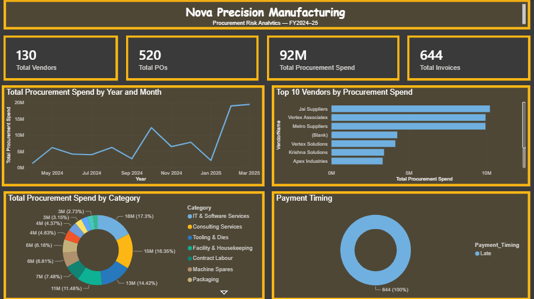

# Nova Precision Manufacturing Procurement Analytics Project

##  Project Overview

This project is a procurement analytics and risk-review project created for a simulated manufacturing company, **Nova Precision Manufacturing Pvt Ltd**.

The objective was to analyze procurement data and identify unusual patterns, process gaps, vendor risks, approval exceptions, and payment-related issues that could be useful for management and audit review.

I approached the project as a Data Analyst by combining **Python, Pandas, SQL concepts, and Power BI** to move from raw data → cleaning → analysis → visualization → business recommendations.

---

##  Business Problem

Nova Precision Manufacturing is a mid-sized auto-components manufacturer with approximately 450 employees and plants in Kanpur and Pune.

The company's statutory auditors had flagged **elevated procurement risk** in the previous management letter.

The management team wanted an independent analytical review of procurement activity before the FY2024–25 audit was closed.

The analysis focused on questions such as:

- Where is procurement spending going?
- Which vendors account for a large share of spending?
- Are there invoices without purchase orders?
- Are there possible duplicate invoices?
- Are transactions exceeding employee approval limits?
- Are multiple vendors using the same bank account?
- Are there unusual vendor–employee relationships?
- How frequently are payments delayed?
- Which procurement controls may need further review?

---

##  Dataset

The project uses four synthetic datasets covering **FY2024–25 (1 April 2024 – 31 March 2025)**:

| Dataset | Description |
|---|---|
| `Vendor_Master` | Vendor details, categories, locations, onboarding and payment terms |
| `Employees_Approvers` | Employee, department and approval-limit information |
| `Purchase_Orders` | Purchase order details and approvals |
| `Invoices_Payments` | Invoice, payment and approval information |

> **Dataset Note:** All data used in this project is synthetic and created for portfolio/learning purposes. It does not contain real company, employee, vendor, or financial information.

---

##  Tools & Technologies

- **Python**
  - Pandas
  - NumPy
  - Matplotlib
  - Data cleaning and transformation
  - Exploratory Data Analysis
- **Power BI**
  - Interactive dashboards
  - KPI cards
  - Filters and slicers
  - Procurement risk analysis
  - Payment analysis
- **GitHub**
  - Project documentation
  - Version control
  - Portfolio presentation

---

##  Project Workflow

```text
Raw Procurement Data
        ↓
Data Profiling & Quality Checks
        ↓
Data Cleaning
        ↓
ID & Relationship Validation
        ↓
Procurement Risk Analysis
        ↓
Exploratory Data Analysis
        ↓
Business Findings
        ↓
Power BI Dashboard

# Power BI Dashboard

The Power BI dashboard was designed to allow management to explore procurement activity from different perspectives.
### Dashboard Preview

#### Executive Overview


#### Vendor Risk & Concentration


#### Procurement Controls & Exceptions



#### Payment Performance & Trends


#### Vendor Investigation


        ↓
Recommendations
